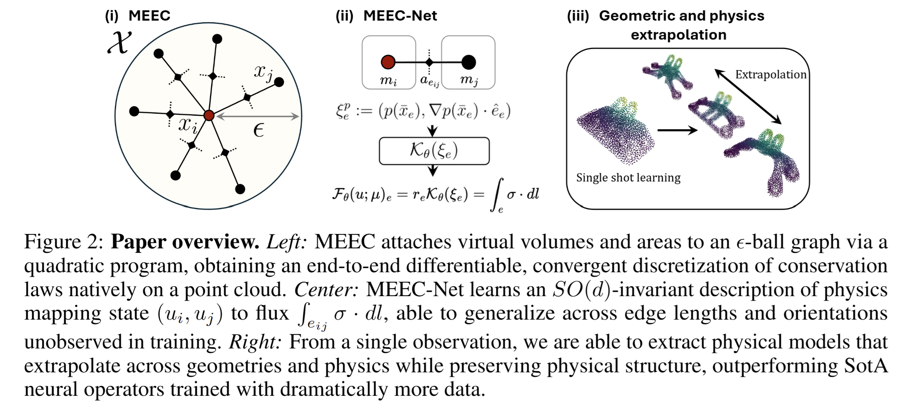
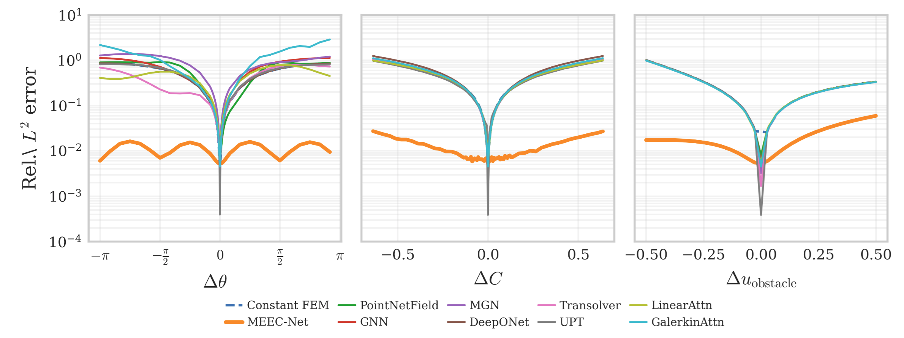
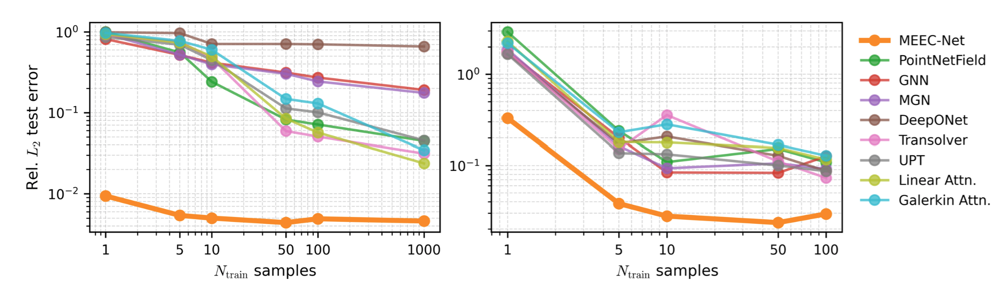

# MEEC-Net

**Meshfree Exterior Calculus** (MEEC) and **MEEC-Net** for structure-preserving learning on point clouds.

Code accompanying our paper **A meshfree exterior calculus for generalizable and data-efficient learning of physics from point clouds**.

## Abstract

We introduce a meshfree exterior calculus (MEEC) for learning structure-preserving descriptions of physics on point clouds, and use it to build MEEC-Net, a data-efficient surrogate that transfers across resolutions, geometries, and physical parameters. MEEC equips an ε-ball graph with virtual node and edge measures via a single sparse Schur complement solve; the resulting complex satisfies discrete conservation exactly, is end-to-end differentiable in the point positions, and exposes a direct geometry-to-physics link without the mesh-generation step required by conventional structure-preserving discretizations. MEEC-Net learns unknown physics as a shared edge-wise flux law in an SO(d)-invariant local frame, so the same kernel produces compatible fluxes on any point cloud whose features lie in the training range. We prove a solution-error bound that splits into discretization and kernel-approximation terms which is independent of problem geometry, explaining the observed transfer from very few examples. We show that single-solution training transfers to unseen geometries, boundary conditions, and physical parameters. On five canonical PDE benchmarks MEEC-Net achieves 1–2 orders of magnitude lower out-of-distribution error than baseline neural-operator approaches. On the SimJEB structural-bracket benchmark it achieves competitive error while using substantially fewer training geometries.



## Key results
We show single shot effective physics recovery in the local flux model, which enables extrapolation over boundary conditions, velocities, and geometries from a single training sample.


We also demonstrate massively improved data efficiency compared to baseline direc-prediction surrogates.


## What's in this repo

A self-contained implementation of the MEEC-Net forward model:

- **MEEC discretization**: equips an ε-ball graph with virtual node and edge measures via a sparse Schur complement solve, producing a discrete exterior calculus complex that satisfies conservation exactly and is differentiable through point positions.
- **Learned flux kernel**: an SO(d)-invariant edge-wise flux law (MeshlessNeW) that produces compatible fluxes on any point cloud whose features lie in the training range.
- **Differentiable Newton solver**: sparse Newton solver with implicit function theorem backward pass.

The current `demo.py` runs a simple Poisson example, which will be update to provide more general hooks to training and evaluation.

## Repository layout

- `src/meshless_dec.py`: MEEC operator assembly on 2D/3D point clouds (node/edge measures, boundary geometry, Laplacian).
- `src/model.py`: MeshlessNeW — encoder, Lipschitz-constrained flux kernel, and learned source model.
- `src/solver.py`: differentiable sparse Newton solver with IFT backward pass.
- `src/utils.py`: graph construction, boundary geometry, FEEC masking/projection utilities.
- `demo.py`: minimal entrypoint — Poisson smoke test and optional short training loop (`--learn`).

## Dependencies

Tested with:

- Python 3.10+
- PyTorch 2.0+
- NumPy
- SciPy

Optional (for DC-PSE with non-negative edge measures):

- `osqp`

Minimal install (CPU):

```bash
pip install torch numpy scipy
```

For GPU / CUDA PyTorch, install PyTorch from the official selector for your platform.

## Quickstart

Run the included demonstration:

```bash
python demo.py
```

For a short training loop:

```bash
python demo.py --learn
```
